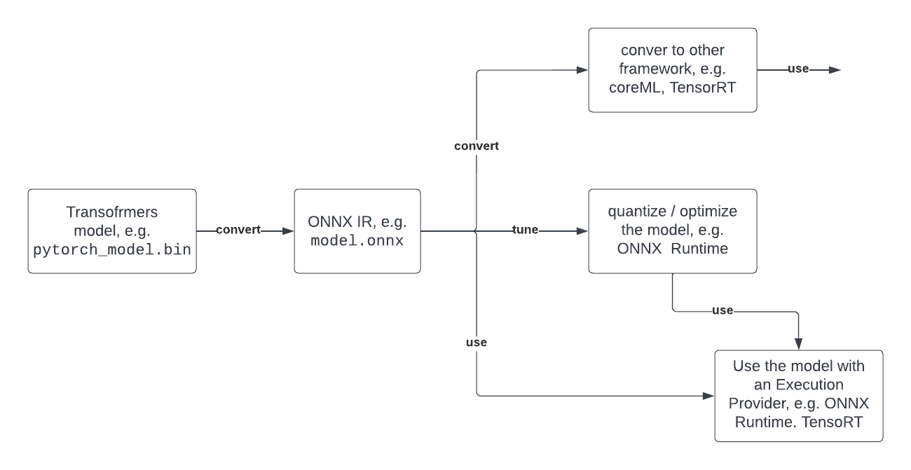

# Dogonomics - Financial Assistant Project

_Development Notes - Updated 8/7/2025_

A modern financial assistant that helps investors make **informed bond investment decisions** and **stock decisions** by analyzing **market trends** and **news sentiment**.

---
## Backend Architecture

### Core Technology Stack

- **Language**: Go (Golang)
    - Fast, easy concurrency
    - Excellent API and HTTP support
    - Direct integration with financial APIs
- **Database**: PostgreSQL/SQLite for trend analysis and data storage
- **ML Pipeline**: Python PyTorch → ONNX → Go ONNX Runtime

### APIs and External Services

| API / Tool        | Purpose                                 | Priority |
| ----------------- | --------------------------------------- | -------- |
| **Finnhub**       | Primary financial data and company info | **High** |
| **Polygon.io**    | Real-time stock data and bond prices    | **High** |
| **EODHD**         | Financial news for sentiment analysis   | **High** |

**Primary Stack**: Finnhub and Polygon.io are the most reliable and well-documented for financial data. EODHD provides quality news data specifically for sentiment analysis.

### Machine Learning Pipeline
#### Sentiment Analysis Model
- **FinBERT**: Deep learning model trained on financial texts
- **Pipeline**: PyTorch → ONNX → Go ONNX Runtime
- **Advantage**: Domain-specific financial sentiment analysis vs. generic VADER model



```bibtex
@misc{yang2020finbert,
  title={FinBERT: A Pretrained Language Model for Financial Communications},
  author={Yi Yang and Mark Christopher Siy UY and Allen Huang},
  year={2020},
  eprint={2006.08097},
  archivePrefix={arXiv},
}
```

#### Prediction Algorithms

| Algorithm                | Purpose                     | Use Case                         |
| ------------------------ | --------------------------- | -------------------------------- |
| **Linear Regression**    | Continuous yield prediction | Baseline model (+2.3% yield)     |
| **Logistic Regression**  | Binary classification       | "70% chance bond will go up"     |
| **Random Forest**        | Non-linear patterns         | Handles missing data well        |
| **XGBoost/LightGBM**     | Gradient boosting           | High accuracy on structured data |
| **ARIMA**                | Time series forecasting     | Future price prediction          |
| **LSTM Neural Networks** | Deep learning sequences     | Long-term trend analysis         |

### Go Backend Structure
#### Core Data Models*
```go
package DogonomicsProcessing

import (
    "time"
    "github.com/MadebyDaris/dogonomics/sentAnalysis"
)

// StockDetailData - Main data structure for frontend integration
type StockDetailData struct {
    CompanyName         string                  `json:"companyName"`
    Description         string                  `json:"description"`
    CurrentPrice        float64                 `json:"currentPrice"`
    ChangePercentage    float64                 `json:"changePercentage"`
    Exchange            string                  `json:"exchange"`
    Symbol              string                  `json:"symbol"`
    AssetType           string                  `json:"assetType"`
    EBITDA              string                  `json:"ebitda"`
    PERatio             float64                 `json:"peRatio"`
    EPS                 float64                 `json:"eps"`
    AboutDescription    string                  `json:"aboutDescription"`
    ChartData           []ChartDataPoint        `json:"chartData"`
    TechnicalIndicators []TechnicalIndicator    `json:"technicalIndicators"`
    SentimentData       []ChartDataPoint        `json:"sentimentData"`
    News                []sentAnalysis.NewsItem `json:"news"`
    AnalyticsData       []ChartDataPoint        `json:"analyticsData"`
}

type ChartDataPoint struct {
    Timestamp time.Time `json:"timestamp"`
    Open      float64   `json:"open"`
    High      float64   `json:"high"`
    Low       float64   `json:"low"`
    Close     float64   `json:"close"`
    Volume    int64     `json:"volume"`
}

type TechnicalIndicator struct {
    Name      string    `json:"name"`
    Value     float64   `json:"value"`
    Signal    string    `json:"signal"` // "BUY", "SELL", "HOLD"
    Timestamp time.Time `json:"timestamp"`
}

type CompanyProfile struct {
    Country          string  `json:"country"`
    Currency         string  `json:"currency"`
    Exchange         string  `json:"exchange"`
    Ipo              string  `json:"ipo"`
    MarketCap        float64 `json:"marketCapitalization"`
    Name             string  `json:"name"`
    Phone            string  `json:"phone"`
    ShareOutstanding float64 `json:"shareOutstanding"`
    Ticker           string  `json:"ticker"`
    WebURL           string  `json:"weburl"`
    Logo             string  `json:"logo"`
    FinnhubIndustry  string  `json:"finnhubIndustry"`
}
```

### Backend Architecture Modules

#### 1. Data Processing Module (`/DogonomicsProcessing`)
**Purpose**: Handle all financial data fetching, processing, and storage
- API integration (Finnhub, Polygon.io, EODHD)
- Data transformation and validation
- Database operations (PostgreSQL/SQLite)
- Real-time data streaming
- Technical indicator calculations

#### 2. Sentiment Analysis Module (`/sentAnalysis`)
**Purpose**: Dedicated ML pipeline for news sentiment analysis
- FinBERT model integration via ONNX Runtime
- News data preprocessing
- Sentiment scoring and aggregation
- Model performance monitoring
- Batch processing for historical analysis

```go
package sentAnalysis

type NewsItem struct {
    ID          string    `json:"id"`
    Title       string    `json:"title"`
    Content     string    `json:"content"`
    Source      string    `json:"source"`
    Timestamp   time.Time `json:"timestamp"`
    Symbol      string    `json:"symbol"`
    Sentiment   float64   `json:"sentiment"`    // -1.0 to 1.0
    Confidence  float64   `json:"confidence"`   // 0.0 to 1.0
}

type SentimentBatch struct {
    Items   []NewsItem `json:"items"`
    Results []float64  `json:"results"`
}
```

### Backend Implementation Status

#### Completed
- Core Go data structures and types
- Package structure (`DogonomicsProcessing`, `sentAnalysis`)
- Basic API endpoint framework
- SQLite/PostgreSQL integration setup

#### TODO
- [ ] Complete sentiment analysis module
- [ ] Implement prediction algorithms
- [ ] Add caching layer for API responses
- [ ] Set up monitoring and logging
- [ ] API rate limiting and error handling
- [ ] Unit and integration tests
- [ ] FinBERT ONNX Runtime integration in `/sentAnalysis`
- [ ] Real-time data pipeline optimization
- [ ] Technical indicator calculations

### Data Flow Architecture

```
Financial APIs (Finnhub/Polygon/EODHD)
            ↓
    Go Backend (/DogonomicsProcessing)
            ↓
    Data Processing & Storage (PostgreSQL/SQLite)
            ↓
    Sentiment Analysis (/sentAnalysis + ONNX Runtime)
            ↓
    Aggregated Results → Frontend API
```

**Note**: All timestamps from financial APIs are in **UTC**. Convert to **Eastern Time (ET)** for market-hour alignment.

---

## Frontend Architecture

### Technology Stack
- **Framework**: Flutter
- **State Management**: Provider/Riverpod (TBD)
- **Charts**: fl_chart ^0.64.0
- **Authentication**: Firebase Auth
- **Database**: Firebase Firestore

### UI Design System
#### Key Components
##### StocksPage
**Features:**
- Interactive price charts with timeframe selector (1D, 1W, 1M, 1Y)
- Three-tab navigation: Overview, Analytics, News Analysis
- Real-time price updates
- Technical indicators (RSI, MACD, Moving Average)

**Tabs Structure:**
1. **Overview**: Key metrics, company information
2. **Analytics**: Performance charts, technical indicators
3. **News Analysis**: Sentiment analysis, recent news with sentiment indicators

##### Authentication System
- Firebase-powered login/registration
- Portfolio synchronization across devices
- Real-time data updates

##### Portfolio Management
- Real-time portfolio tracking
- Add/remove stocks with confirmation dialogs
- Multi-device synchronization via Firebase

### Frontend Implementation Status
#### Completed
- Basic UI framework and navigation
- Dark theme implementation
- Stock detail pages with charts
- Firebase authentication integration
- Portfolio management system

#### In Progress
- [ ] Real-time chart updates
- [ ] News sentiment visualization
- [ ] Performance analytics dashboard
#### TODO
- [ ] Push notifications for price alerts
- [ ] Offline data caching
- [ ] Advanced charting features
- [ ] User preferences and settings
- [ ] Portfolio performance analytics

### Firebase Database Structure

```
users/{userId}/
├── email: "user@example.com"
├── username: "username"
├── createdAt: timestamp
└── portfolio: [
    {
      symbol: "AAPL",
      name: "Apple Inc",
      code: "ETF",
      price: 150.25,
      change: 2.5
    }
  ]
```

---

## Deployment Architecture

```
┌───────────────────┐     ┌──────────────────────┐
│   Flutter App     │ <-> │   Golang REST API    │
│   (Mobile/Web)    │     │ /DogonomicsProcessing │
└───────────────────┘     └────────┬─────────────┘
                                   │
     ┌─────────────────────────────┴────────────────────────────┐
     │              Financial APIs                              │
     │         (Finnhub, Polygon.io, EODHD)                    │
     └──────────────────────────────────────────────────────────┘
                                   │
                ┌──────────────────┴────────────────────┐
                │     Backend Modules                   │
                │  Data Processing + Sentiment Analysis │
                │    (PostgreSQL/SQLite + ONNX)         │
                └───────────────────────────────────────┘
```

---

## Development Notes

### Why Go Over Rust?

### Data Sources Strategy
- Use **Bond ETFs** (AGG, BND) as proxies for real-time bond prices
- Track **credit spreads** and **yield curves** via FRED and ICE BofA
- Implement **sentiment analysis** on financial news for market insights

### Next Development Priorities
1. Complete ONNX integration in Go backend
2. Implement real-time data streaming
3. Add advanced portfolio analytics
4. Deploy production infrastructure
5. Add comprehensive testing suite

---

_Developed by Daris Idrene_  
[Website](https://madebydaris.github.io/) | [GitHub](https://github.com/MadebyDaris)