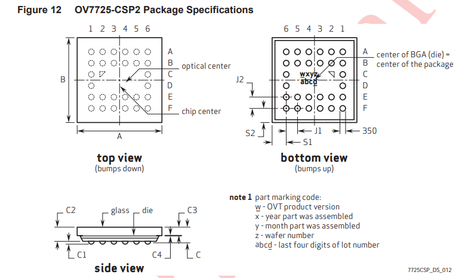

In this post, you can find the notes I took while working in KiCad, here I worked mainly on using the ESP32 chip and creating a basic board, as well as a camera and the ESP32.

## FIRST STEPS
#### MICRO PROCESSOR
I will be using the ESP32 chip microcontroller, for its wifi and bluetooth capability and especially for the Xtensa LX6 microprocessor variations.

Here are the different chips of the ESP32 family
	ESP32-D0WD-V3 
	ESP32-D0WDR2-V3 
	ESP32-U4WDH 
	ESP32-PICO-V3 
	ESP32-PICO-V3-02 
	ESP32-PICO-D4
the main differences between these models are their packaging (QFN, UFBGA, SiP), integrated flash memory, and specific enhancements in features like RAM or power management.

I will be using the ESP32-C3 variant 
[Datasheet](https://www.espressif.com/sites/default/files/documentation/esp32_datasheet_en.pdf)
#### HERE ARE SOME SOURCES WE MIGHT NEED FOR THE PROJECT
https://docs.espressif.com/projects/esp-hardware-design-guidelines/en/latest/esp32/pcb-layout-design.html
It is recommended to use a four layer PCB
With the following configuration
- Layer 1 (TOP): Signal traces and components.
- Layer 2 (GND): No signal traces here to ensure a complete GND plane. 
- Layer 3 (POWER): GND plane should be applied to better isolate the RF and crystal. Route power traces and a few signal traces on this layer, provided that there is a complete GND plane under the RF and crystal.
	- An electronic oscillator circuit known as a Surface Mount Device (SMD) crystal oscillator produces a steady frequency signal using a **quartz crystal resonator**.
- Layer 4 (BOTTOM): Route a few signal traces here. It is not recommended to place any components on this layer.

We could generate symbols and footprints for the ESP32 microchip
https://github.com/espressif/kicad-libraries.git
#### FEATURES TO INTEGRATE INTO OUR BOARD
https://www.espressif.com/en/products/modules
you can find more modules and components on Digi-Key
 - QWIIC connector 
	 - **a standardized, plug-and-play connectivity system developed by SparkFun Electronics**.
 - Camera module
	 - OV7725
		 - The code supports the [OV2640](https://www.uctronics.com/download/cam_module/OV2640DS.pdf) camera module with output JPEG format, and both the OV2640 and the newer [OV7725](https://www.ovt.com/sensors/OV7725) module with output a _“grayscale format.”_ Interestingly, the demo code even supports full blown QR code recognition.
		 - https://github.com/donny681/ESP32_CAMERA_QR/blob/master/README.md
	 - Or alternatively the MT9M114EBLSTCZ-CR
		 - https://www.digikey.com/en/products/detail/onsemi/MT9M114EBLSTCZ-CR/5321744

#### HOW DOES THE CAMERA CHIP WORK AND IMPLEMENTATION ON THE ESP32

##### OV07725
Two different camera sensors CCD and CMOS sensors.
OV7725 Specific pins used in this example to connect ESP32 and camera
- Power Supply 3.3V
- **Camera pin** column refers to pinout on OV7725 camera module
- for STM32 but it's a good referenc
	- https://www.youtube.com/watch?v=oVzuphK4haQ
Pin Mapping

#### COMPONENTS
- ESP32C3
- USB-C receptable Full Features
- CP2104 USB Interface
	- **a highly-integrated USB-to-UART Bridge in a compact 4 mm x 4 mm package**.
- USBLC6
	- ESD protection of high speed interfaces, such as USB 2.0, Ethernet links and video lines.
- Image Sensor 
#### BUIILDING THE SYMBOL FOR THE OV7725

	

	The OV7725 is an integrated cuicuit Camera chip.
Here is the pinout firgure found on the data sheet, this will help us create the symbol for the OV7725, and the pins in particular.

## SCHEMATIC
We move on to the schematic, here is one from we will use as a base provided by espressif

Sources
- Example circuit, https://files.seeedstudio.com/wiki/XIAO_WiFi/Resources/Seeeduino-XIAO-ESP32C3-SCH.pdf
- ESP32C3 Design guidelines , https://docs.espressif.com/projects/esp-hardware-design-guidelines/en/latest/esp32c3/index.html

Any basic ESP32-C3 circuit design may be broken down into the following major building blocks:
- [Power supply](https://docs.espressif.com/projects/esp-hardware-design-guidelines/en/latest/esp32c3/schematic-checklist.html#power-supply)
- [Chip power-up and reset timing](https://docs.espressif.com/projects/esp-hardware-design-guidelines/en/latest/esp32c3/schematic-checklist.html#chip-power-up-and-reset-timing)
- [Flash](https://docs.espressif.com/projects/esp-hardware-design-guidelines/en/latest/esp32c3/schematic-checklist.html#flash)
- [Clock source](https://docs.espressif.com/projects/esp-hardware-design-guidelines/en/latest/esp32c3/schematic-checklist.html#clock-source)
- [RF](https://docs.espressif.com/projects/esp-hardware-design-guidelines/en/latest/esp32c3/schematic-checklist.html#rf)
- [UART](https://docs.espressif.com/projects/esp-hardware-design-guidelines/en/latest/esp32c3/schematic-checklist.html#uart)
- [Strapping pins](https://docs.espressif.com/projects/esp-hardware-design-guidelines/en/latest/esp32c3/schematic-checklist.html#strapping-pins)
- [GPIO](https://docs.espressif.com/projects/esp-hardware-design-guidelines/en/latest/esp32c3/schematic-checklist.html#gpio)
- [ADC](https://docs.espressif.com/projects/esp-hardware-design-guidelines/en/latest/esp32c3/schematic-checklist.html#adc)
- [USB](https://docs.espressif.com/projects/esp-hardware-design-guidelines/en/latest/esp32c3/schematic-checklist.html#usb)

### POWER SUPPLY
ESP32’s VDDA and VDD3P3 pins are the analog power supply pins, 
working at 2.3 V ~ 3.6 V.

For VDD3P3, when ESP32 is transmitting signals, there may be a sudden increase in the current draw, causing power rail collapse. Therefore, it is highly recommended to add a 10 μF capacitor to the power rail, which can work in conjunction with the 1 μF capacitor(s). Add a LC circuit on the VDD3P3 power rail to suppress high-frequency harmonics. The inductor’s rated current is preferably 500 mA and above.
### EXTERNAL CRYSTAL CLOCK SOURCE
The ESP32-C3 firmware only supports 40 MHz crystal

#### FLASH MEMORY
- **CS (Chip Select) -> GPIO14 (SPICS0)**
- **SCK (Serial Clock) -> GPIO15 (SPICLK)**
- **SI/IO0 (Serial Input/IO0) -> GPIO16 (SPID)**
- **SO/IO1 (Serial Output/IO1) -> GPIO17 (SPIQ)**
- **WP/IO2 (Write Protect/IO2) -> GPIO13 (SPIWP)**
- **HOLD/IO3 (Hold/IO3) -> GPIO12 (SPIHD)**
- **GND (Ground) -> GND
- **VCC (Power) -> VDD_SPI (Power supply for SPI)**
And doesnt get the 3.3V directly but through the VDDSPI

**GPIO4 to GPIO7 (Pins 9 to 12):**

- These General-Purpose Input/Output (GPIO) pins have multiple functions, including:
    - **GPIO4 (MTMS/ADC1_CH4):** Can be used as a general-purpose input/output or for JTAG or ADC (Analog-to-Digital Converter) functions.
    - **GPIO5 (MTDI/ADC2_CH0):** Can be used as a general-purpose input/output or for JTAG or ADC functions.
    - **GPIO6 (MTCK):** Can be used as a general-purpose input/output or for JTAG.
    - **GPIO7 (MTDO):** Can be used as a general-purpose input/output or for JTAG.

Voltage Regulator Circuit
https://www.reddit.com/r/PrintedCircuitBoard/comments/1791brh/schematic_review_a_pcb_board_based_around_the/#lightbox

The circuit you provided is a typical application circuit for a step-down (buck) DC-DC converter, specifically using the **AP63200WU** as the regulator IC. The circuit converts a higher input voltage (+5V) to a lower output voltage (+3.3V). Let's go through the selection of component values for the capacitors and resistors.

### 1. **CAPACITORS:**

- **C11 (Input Capacitor):**
    - The input capacitor is crucial for filtering the input voltage and smoothing out any high-frequency noise. Typically, a 10 µF ceramic capacitor is recommended. This value provides good filtering for the input, and ceramic capacitors are preferred due to their low ESR (Equivalent Series Resistance).
- **C12, C13 (Output Capacitors):**
    - The output capacitors help to smooth the output voltage and reduce ripple. For a 3.3V output, using two 22 µF ceramic capacitors is a common choice. The combination of two capacitors in parallel helps reduce the output ripple and improve transient response. The total capacitance would be 44 µF with a lower effective ESR, which is beneficial for the regulator's performance.
- **C14 (Bootstrap Capacitor):**
    - The bootstrap capacitor is used to drive the gate of the high-side MOSFET inside the IC. This capacitor typically has a small value, often 0.1 µF. A ceramic capacitor is recommended here as well.
- **C15 (Compensation Capacitor):**
    - Sometimes there might be a capacitor connected to the FB pin for compensation to stabilize the feedback loop. This is optional and depends on the specific design and stability requirements. A typical value could be around 10 nF.

- The inductor value is chosen based on the desired output voltage, current, and switching frequency of the regulator. For the AP63200, a value between 4.7 µH and 10 µH is typically chosen. Higher inductance reduces ripple but can slow the response time.

### 3. **RESISTORS:**

- **R4, R5 (Feedback Resistors):**
    - These resistors set the output voltage of the regulator. The formula for setting the output voltage is:
        
        $$ V_{out} = V_{FB} \times \left(1 + \frac{R4}{R5}\right)$$
        
        Where $$V_{FB} = 0.6V$$​ for the AP63200.
        
        To set the output to 3.3V:
        
        $$ 3.3V = 0.6V \times \left(1 + \frac{R4}{R5}\right)$$
        
        Solving this gives:
        So, you can choose R5 as 10 kΩ and R4 as 45 kΩ. However, it's common to use standard resistor values, so you might choose R4 as 47 kΩ and R5 as 10 kΩ, which gives a slightly higher output voltage of around 3.32V.
        

### 4. **ADDITIONAL CAPACITORS:**

- **C11:** A bypass capacitor (100nF to 1µF) is usually placed close to the input to filter out high-frequency noise.