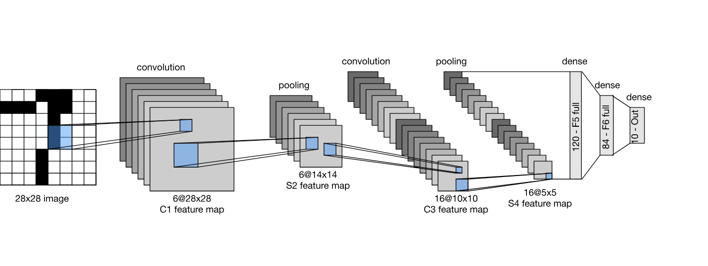
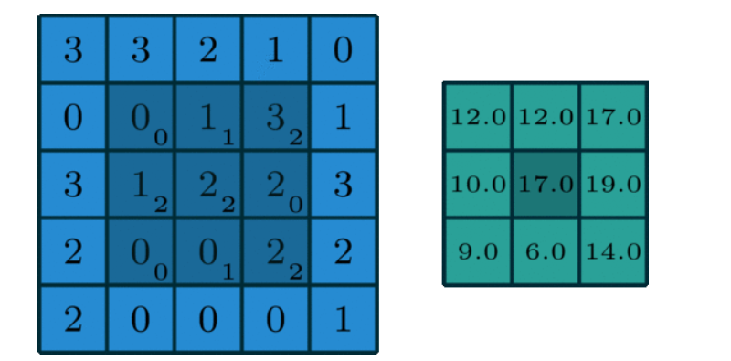
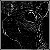
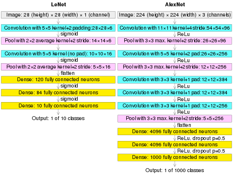
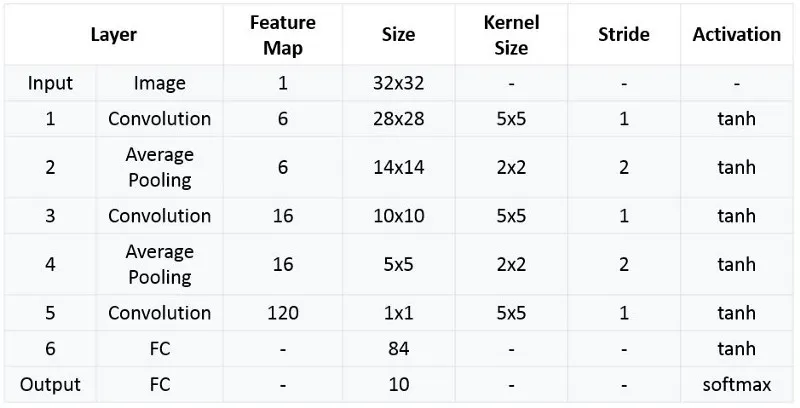

# Convolution Neural Network implementation


This comprehensive guide explores Convolutional Neural Networks (CNNs) from mathematical foundations to practical implementation. We'll use the MNIST dataset as our primary example, but the principles extend to creating synthetic datasets with OCR fonts and beyond.

## I | Mathematical Foundations
Source of the following model inspired by : 
- https://d2l.ai
- https://www.deeplearningbook.org/  by Ian Goodfellow and Yoshua Bengio and Aaron Courville
#### Probability
If we know the probability distribution over a set of variables and we want
to know the probability distribution over just a subset of them. The probability
distribution over the subset is known as the marginal probability distribution.

Suppose we have discrete random variables $X$ and $Y$.
<!-- $$ \forall x \in X,P(X = x) $$ -->
$$ \forall x \in X, P(X = x) = \sum_y P(X = x, Y = y) $$
Assuming that the random variable Y is countable of course.

The concept of **mutual information** helps us understand what CNNs learn:
$$ I(X; Y) = \sum_{x,y} p(x,y) \log \frac{p(x,y)}{p(x)p(y)} $$

This measures how much information about input $X$ is contained in feature map $Y$, helping us understand why deeper layers capture more abstract features.


## II | What are convolutions and MLP's
$Let \ n \in \mathbb {N}$ 
and
$\ X \in M_n (\mathbb{R})$, representing an input image through a $n×n$ matrix.


### 1.0.1 [From MLPs to Convolutions: The Evolution](https://towardsai.net/p/machine-learning/the-multilayer-perceptron-built-and-implemented-from-scratch)

We define a multilayer Perceptron (MLP) $H$ with the following:

$\exists (U, V) \in  M_n (\mathbb{R})^2, $ 
$$
\forall (i, j) \in [1, n]^2, \quad
H_{i, j} = U_{i, j} + \sum_k \sum_l W_{i, j, k, l} X_{k, l}
= U_{i, j} + \sum_a \sum_b V_{i, j, a, b} X_{i+a, j+b}.
$$
such that $V_{i, j, a, b} = W_{i, j, i+a, j+b}$

**The Problem**: This formulation requires $O(n^4)$ parameters for an $n \times n$ image, making it computationally intractable for realistic image sizes.

If you feed an image of size $n×n$ as described earlier:
To use a multilayer perceptron (MLP), you first flatten it into a vector of size $n^2$

A fully connected layer then connects every input pixel to every neuron in the hidden layer.

If the hidden layer is also of size $n^2$
$$n^2 × n^2 = n^4$$

That’s O(n⁴) parameters

### 1.0.2 Principle of translation invariance

This implies that a shift in the input $X$ should simply lead to a shift in the hidden representation $H$. This is only possible if $U$ and $V$ do not actually depend on $(i,j)$. We can then note $V_{i,j,a,b} = V_{a,b}$ and that $U$ is a constant, allowing us to simplify the definition for $H$:
$$
H_{i, j} = U + \sum_a\sum_b V_{a,b} X_{i+a,j+b}.
$$

### 1.0.3 Locality Principle

Real-world images exhibit **spatial locality** - nearby pixels are more correlated than distant ones. This motivates restricting our summation to a local neighborhood:

$$
H_{i, j} = U + \sum_{a=-k}^{k}\sum_{b=-k}^{k} V_{a,b} X_{i+a,j+b}
$$

where $k$ defines the **receptive field** size.
$k$ controls how far we look around each pixel — in other words, it defines the size of the local region (also called the neighborhood) used to compute the output.


This just means:

> "To compute the value at position $(i, j)$ in the output image $H$, we take a **small patch** of the input image $X$ centered at $(i, j)$, multiply it elementwise by a filter $V$, and sum the results."


### 2.0.1 Convolution of functions
In mathematics, the convolution product is a bilinear operator and a commutative product (commutativity), generally denoted by "∗", which, given two functions  𝑓 and 𝑔 over the same infinite domain, associates another function "𝑓∗𝑔" on this domain.
$$
\forall (f,g) \in {\mathbb (R}^{\mathbb{R}})^2, \forall x \in \mathbb{R} \qquad
(f*g)(x) = \int_{-\infty}^{_{+\infty}} g(t-x)f(t)dt
$$

### 2.0.2 Convolution for images
For discrete signals (like digital images), convolution becomes:
$$
(f * g)[n] = \sum_{m=-\infty}^{\infty} f[m] \cdot g[n-m]
$$



Better yet, for images we can use this notation, which seems bizarre but you get used to it.
$$
(I * K)[i,j] = \sum_m \sum_n I[m,n] \cdot K[i-m, j-n]
$$
- We get the edges trimmed off this isn't useful, as we want the input to be the same size as the output We can add fake pixels in order to circumvent this issue We call this **padding**.


## III | Example with cross-correlation

**Important Note**: In practice, most deep learning frameworks implement **cross-correlation** rather than true convolution:

*Implementation in julia using JuliaImage and DSP(digital signal processing)* 

#### Edge detection kernel (Laplacian)
```julia
float_array = float64.(channelview(Gray.(img)))

# Edge detection kernel (Laplacian)
conv_mat =  [-1 -1 -1
             -1  8 -1
             -1 -1 -1]

output = conv(float_array, conv_mat)
img_out = colorview(Gray, output)
img_out
```

Output :

 

### Common Kernels and Their Effects

```julia
# Gaussian blur (smoothing)
gaussian_3x3 = [1 2 1
                2 4 2
                1 2 1] / 16

# Sobel edge detection (horizontal)
sobel_x = [-1 0 1
           -2 0 2
           -1 0 1]

# Sobel edge detection (vertical)  
sobel_y = [-1 -2 -1
            0  0  0
            1  2  1]

# Sharpening kernel
sharpen = [ 0 -1  0
           -1  5 -1
            0 -1  0]
```

### 3.0.4 Mathematical Properties of Convolution
These are always good to remember
1. **Commutativity**: $f * g = g * f$
2. **Associativity**: $(f * g) * h = f * (g * h)$
3. **Distributivity**: $f * (g + h) = (f * g) + (f * h)$
4. **Differentiation**: $\frac{d}{dx}(f * g) = \frac{df}{dx} * g = f * \frac{dg}{dx}$

## IV | CNN Architecture Overview
*Reference: https://towardsdatascience.com/intuitively-understanding-convolutions-for-deep-learning-1f6f42faee1*

A `Sequential` model is appropriate for **a plain stack of layers** where each layer has **exactly one input matrix and one output Matrix**.

I will use the LeNet model as inpsiration and first get an undestanting on how the LeNet model works on the infamous MNIST database, and Implement that for the OCR database

### 4.0.1 The LeNet Architecture




LeNet-5, proposed by Yann LeCun, consists of:

1. **C1**: Convolutional layer (6 feature maps, 5×5 kernel)
2. **S2**: Subsampling layer (2×2 average pooling)  
3. **C3**: Convolutional layer (16 feature maps, 5×5 kernel)
4. **S4**: Subsampling layer (2×2 average pooling)
5. **C5**: Convolutional layer (120 feature maps, 5×5 kernel)
6. **F6**: Fully connected layer (84 units)
7. **Output**: Fully connected layer (10 units for MNIST)

### Implementation
we're going to use the FluxML package for Julia to implement the convolution

Here's a way to implement fitting a line with Flux in Julia
```julia
using Flux
func(x) = 2x + 9

x_train, x_test = hcat(0:5...), hcat(6:10...)
y_train, y_test = func.(x_train), func.(x_test)
```

## V | CNN Components : Diving into it

#### Activation Functions

**ReLU (Rectified Linear Unit)**:
$$
\text{ReLU}(x) = \max(0, x)
$$

**Advantages**:
- Computationally efficient
- Helps with gradient flow
- Introduces non-linearity

**Leaky ReLU**:
$$
\text{LeakyReLU}(x) = \begin{cases} 
x & \text{if } x > 0 \\
\alpha x & \text{if } x \leq 0
\end{cases}
$$


#### Pooling Operations

**Max Pooling**:
$$
\text{MaxPool}_{i,j} = \max_{(m,n) \in R_{i,j}} X_{m,n}
$$

**Average Pooling**:
$$
\text{AvgPool}_{i,j} = \frac{1}{|R_{i,j}|} \sum_{(m,n) \in R_{i,j}} X_{m,n}
$$

where $R_{i,j}$ is the pooling region.


#### Batch Normalization

Normalizes inputs to each layer:
$$
\hat{x}^{(k)} = \frac{x^{(k)} - E[x^{(k)}]}{\sqrt{\text{Var}[x^{(k)}] + \epsilon}}
$$

Then applies learnable parameters:
$$
y^{(k)} = \gamma^{(k)} \hat{x}^{(k)} + \beta^{(k)}
$$


--- Still a work in progress