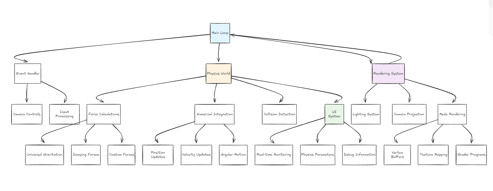

# Building Inertia: A Journey into Real-Time Physics Simulation

Inertia is a Rust-based physics engine, that can help physicians or student model simulations with a broad uses, with a modular system, be it with the ui or actual simulation and object system.

[Here you can watch a rudimentary example](https://www.youtube.com/watch?v=OP_sJ9b2lhw&ab_channel=DarisIdirene)

## Why Rust? Why OpenGL?

Choosing the right tools was crucial. I needed:
- **Memory safety** for complex simulations
- **Performance** for real-time physics calculations  
- **Graphics power** for stunning visualizations
- **Cross-platform** compatibility

Rust emerged as the perfect candidate. Its zero-cost abstractions meant I could write safe, expressive code without sacrificing the performance needed for 60+ FPS physics simulations. Combined with OpenGL's mature graphics pipeline, I had a solid foundation for bringing celestial mechanics to life.

```rust
// The heart of celestial mechanics in just a few lines
pub fn universal_gravitation_force(&self, body: &AstralBody, g: f32) -> Force {
    let direction = position_euclidean(&body.mesh) - position_euclidean(&self.mesh);
    let distance_squared = direction.magnitude().powi(2);
    let mu: f32 = g * body.mass * self.mass;
    
    Force {
        direction: direction.normalized(), 
        magnitude: mu / distance_squared
    }
}
```

## Architecture: Building a Universe
Inertia's architecture reflects the natural separation between physics and presentation. Here's how the pieces fit together:


### The Physics Engine

The core of Inertia lies in its physics engine. Each celestial body is represented by an `AstralBody` struct containing:
- **Kinematic properties**: position, velocity, acceleration
- **Physical properties**: mass, radius, moment of inertia
- **Rotational dynamics**: angular velocity, angular acceleration, orientation
- **Force accumulation**: gravitational, damping, and custom forces

The genius is in the simplicity. Newton's second law (F=ma) drives everything:

```rust
pub fn law_of_momentum(&mut self) {
    let mut resultant_force = Vector(0.,0.,0.);
    for force in &self.forces {
        resultant_force += force.direction * force.magnitude
    }
    if self.mass != 0.0 {
        self.acceleration = resultant_force / self.mass;
    }
    // ... angular dynamics ...
    self.forces.clear(); // Reset for next frame
}
```

### Rendering Pipeline

While physics provides the substance, the rendering system provides the soul. Inertia uses a modern OpenGL pipeline with:

1. **Procedural Sphere Generation**: Mathematical perfection in mesh form
2. **Physically-Based Lighting**: Realistic illumination that respects the laws of optics  
3. **Texture Mapping**: Bringing celestial bodies to life with real planetary textures
4. **Dynamic Camera System**: Smooth navigation through 3D space

The sphere generation deserves special mention. Using spherical coordinates, we create perfect celestial bodies:

```rust
let x = self.radius * sin_theta * cos_phi;
let y = self.radius * cos_theta;  
let z = self.radius * sin_theta * sin_phi;
```

Each vertex carries position, normal, and texture coordinates – everything needed for realistic rendering.

## The Challenges: Wrestling with Reality 

Building a physics engine taught me that the universe is beautifully complex. Here are some challenges I encountered:

### Numerical Integration Nightmares
Real-time physics demands compromise. Euler integration is fast but can be unstable. Too large a time step and planets go flying off to infinity. Too small and the simulation crawls. Finding the sweet spot required extensive testing and tuning.

### The Three-Body Problem
Two bodies? Easy. Three bodies? that's chaos theory.

### Performance vs. Accuracy
Every frame, Inertia calculates gravitational forces between all bodies – an O(n²) operation. With just 10 bodies, that's 45 force calculations per frame. At 60 FPS, that's 2,700 calculations per second. Optimization became crucial.

### Graphics Pipeline Complexity  
OpenGL is powerful but unforgiving. Vertex shaders, fragment shaders, buffer management, texture loading – each component must work flawlessly or nothing renders. Debugging graphics issues often meant staring at a black screen wondering what went wrong.

## The Breakthrough Moments

**Real-Time UI Integration**: Adding `egui` for real-time parameter monitoring transformed Inertia from a tech demo into an educational tool. Suddenly, users could see the relationship between mass, velocity, and orbital characteristics.

**The Three-Body Dance**: Creating a stable three-body system felt like conducting a cosmic orchestra. Each body influences the others, creating intricate patterns that emerge from simple rules.

## Technical Deep Dive: The Code Behind the Cosmos

Let me walk you through some key technical decisions:

### Force Calculation Macros
To simplify multi-body interactions, I created macros that handle the repetitive force calculations:

```rust
calculate_g_forces!(body_1, &body_2, &body_3);
update_astral_body_physics!(body_1, delta_time);
```

These expand into the necessary loops and calculations, keeping the simulation code clean and readable.
As well as making the forces system modular, similar to how a physics textbook would consider physics systems.

### Modular Mesh System
The mesh system separates geometry from physics. A `MeshObject` contains:
- Vertex data (positions, normals, texture coordinates)
- Index buffers for efficient rendering
- Transformation matrices for positioning
- Shader programs for visual effects

This separation allows the same physics body to have different visual representations.

### Camera Mathematics
The camera system implements proper 3D navigation using view matrices:

```rust
pub fn view_matrix(&mut self) -> TransformMatrix {
    let f = self.direction.normalized();
    let s = Vector::cross(f, self.up).normalized();
    let u = Vector::cross(f, s);
    // ... matrix construction ...
}
```

This creates the illusion of moving through 3D space while maintaining mathematical correctness.

## Lessons Learned

### 1. Start Simple, Then Complexify
I began with two spheres and basic gravity. Only after perfecting this foundation did I add rotation, multiple bodies, and advanced features. Each layer built upon solid ground.

### 2. Debug Early, Debug Often
Physics bugs are subtle. A small error in force calculation might not be obvious until bodies start spiraling into impossible orbits. Comprehensive logging and visualization were essential.

### 3. Performance Matters from Day One
Real-time simulation is unforgiving. Frame drops destroy the illusion. I learned to profile early and optimize continuously rather than hoping for the best.

### 4. Mathematics Is Your Friend
Every graphics operation, every physics calculation, every transformation matrix – it's all mathematics. Embracing the math rather than fearing it made development much smoother.

## The Road Ahead

Inertia is just the beginning. Here's what's coming next:

### Immediate Priorities
- **Advanced Integration Methods**: Runge-Kutta for better numerical stability
- **Collision Detection**: What happens when worlds collide?
- **Binary Star Systems**: Complex gravitational systems with multiple stars
- **Orbital Prediction**: Visualizing future trajectories

### Long-term Vision
- **Procedural Planet Generation**: Unique worlds with realistic features
- **Atmospheric Effects**: Clouds, weather, and realistic lighting
- **Spacecraft Simulation**: Trajectory planning and mission design
- **Educational Modules**: Guided lessons in orbital mechanics
- Branching out into other physics sectors might also be very interesting.


## Why This Matters?

Inertia isn't just about pretty graphics or impressive physics calculations. It's about making complex concepts accessible. When a student can adjust a planet's velocity and immediately see the orbital change, abstract mathematics becomes concrete understanding.

In an age where STEM education struggles with engagement, interactive simulations bridge the gap between theory and intuition. Inertia proves that learning can be both rigorous and fun.


## Getting Started: Your Journey Begins Now

Ready to explore the cosmos? Here's how to begin:

1. **Clone the repository**: `git clone https://github.com/MadebyDaris/Inertia.git`
2. **Build and run**: `cargo run --release`
3. **Experiment**: Modify parameters, create new scenarios
4. **Learn**: Study the code, understand the physics
5. **Contribute**: Share improvements, report bugs, suggest features

## Conclusion: The Universe Awaits

Building Inertia has been a journey through mathematics, physics, computer graphics, and software engineering.