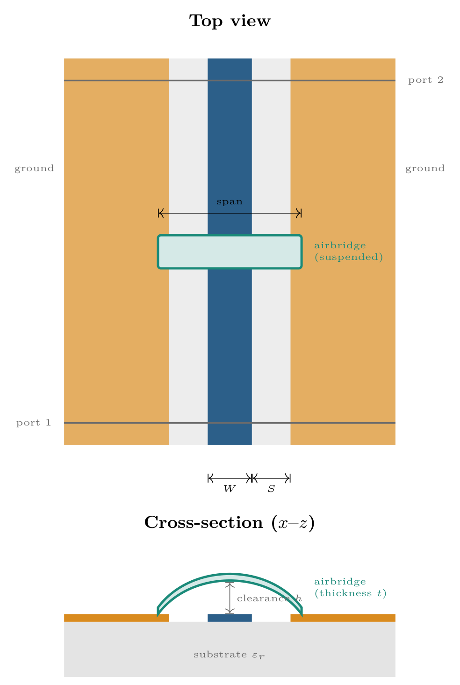
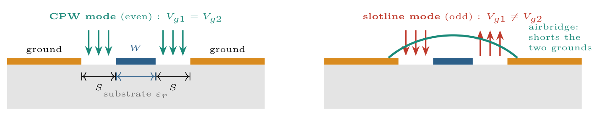
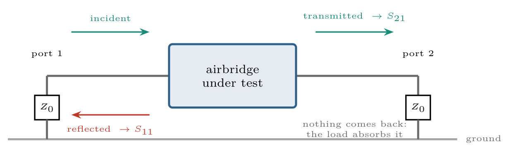
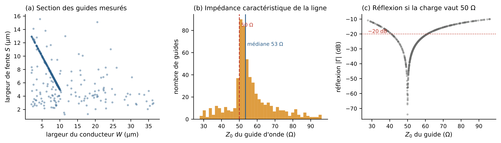
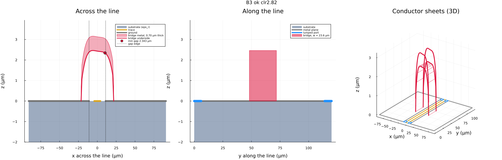
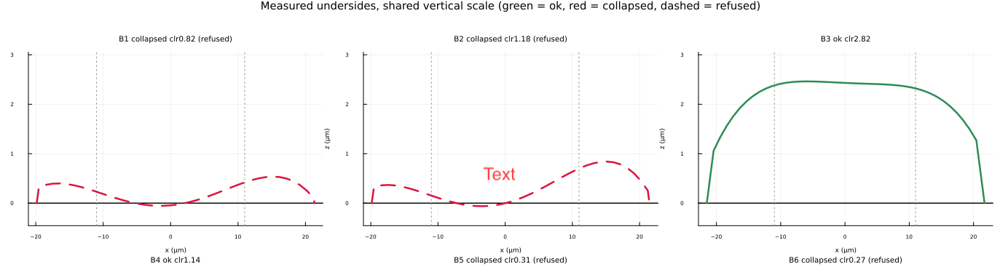
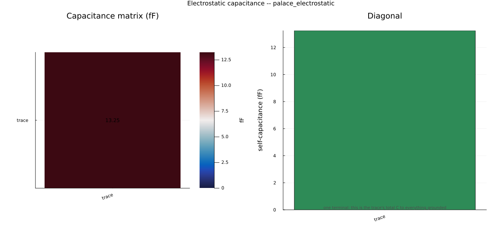
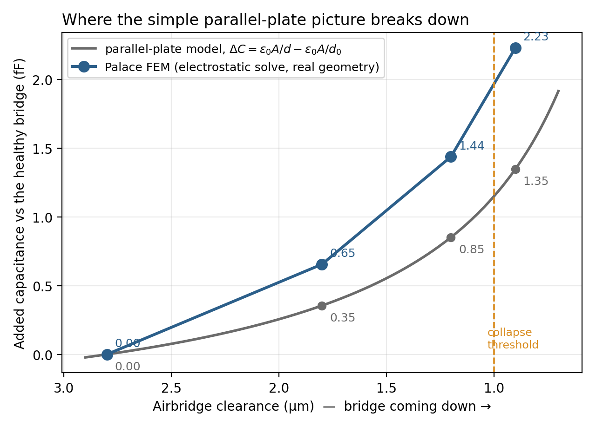
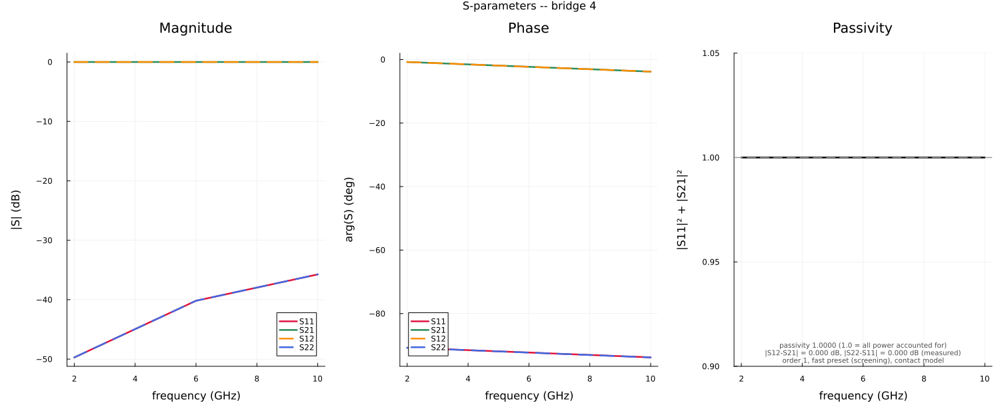
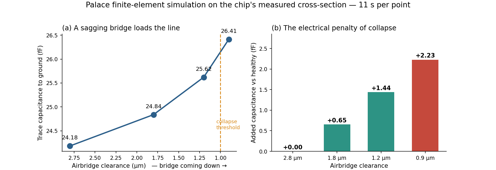

## Why bother simulating a piece of bent metal

An airbridge is a small arch of metal, a few tens of micrometers long, that hops over a transmission line and ties the two ground planes on either side back together. During my internship at Alice & Bob, part of my job was figuring out what happens electrically when one of these bridges sags or collapses. Inspection tools can tell you a bridge has sagged, they just can't tell you what it costs the circuit: whether a 1.8 µm bridge is a cosmetic blemish or the reason a resonator two components away has a dip in its response.

Getting a real answer means simulating the actual measured shape rather than an idealized CAD bridge. This post walks through how I built that simulation, first with a fast frequency-domain solver (**Palace**), then with the time-domain approach I tried first and eventually gave up on (**meep**), and what the two together taught me about what a collapsing bridge actually does to a line.

## The physical picture

The thing being simulated is one coplanar waveguide cross-section with a single airbridge over it. Figure 1 shows the two views that matter: from above, a central signal trace of width $W$ running between two ground planes, separated by gaps of width $S$; and in cross-section, the bridge arching over the trace with some clearance $h$ between its underside and the trace.

Two numbers end up doing almost all the work here: $h$, the clearance (which is what "collapse" means running out of), and the ratio of $W$ to $S$, which sets the line's characteristic impedance.

## Why the airbridge is there at all

A coplanar waveguide with two separate ground planes actually supports two independent modes, and this is really the whole reason airbridges exist on real chips.

Figure 2 shows both. In the even, or CPW, mode, the field runs from the central conductor out to each ground plane, and both grounds sit at the same potential. This is the useful mode, the one a CPW is designed to carry. In the odd, or slotline, mode, the two grounds are driven to different potentials instead. Any asymmetry along the line a bend, a T-junction, a fabrication defect, a nearby bond wire bleeds some energy from the good mode into this bad one, and once a signal is partly in the slotline mode it starts radiating and coupling. On a chip full of qubits, that's a direct route to crosstalk.

What an airbridge actually does is tie the two grounds together at regular intervals, which forces them to the same potential and makes the slotline mode impossible to sustain locally. A bridge that's sagged enough to lose electrical contact has stopped doing that job  arguably a bigger deal than the parasitic capacitance discussed below, though harder to see in a two-port simulation of a single cross-section.

## Turning "does this bridge disturb the line" into a number

The way to quantify this is to treat the bridge as a black box sitting in an otherwise uniform line, probed from one end. Three waves matter: the incident wave going in, the reflected wave bouncing back out the same end, and the transmitted wave coming out the far end. The S-parameters are just the amplitude ratios between them:

$$S_{11} = \frac{\text{reflected}}{\text{incident}}, \qquad S_{21} = \frac{\text{transmitted}}{\text{incident}}$$

$S_{11}$ is reflection, $S_{21}$ is transmission, and a healthy bridge should barely register: $S_{21} \approx 1$, $S_{11} \approx 0$.

Since power scales as amplitude squared, conservation of energy for a lossless two-port comes out as

$$|S_{11}|^2 + |S_{21}|^2 \le 1$$

with equality when nothing along the way is lost. I ended up using this constantly as a sanity check, a result sitting well below 1 usually means power is leaking out somewhere in the mesh or the boundary conditions, not that the bridge is somehow lossy.

**Why both ends need a load.** For $S_{11}$ and $S_{21}$ to actually describe the bridge and nothing else, the transmitted wave has to leave the domain for good. Leave the far end open and it reflects straight back, and now the measurement is silently "bridge plus whatever's at the far end" no way to separate the two after the fact. So each end gets a matched load: a resistor equal to the line's own impedance $Z_0$, which absorbs the wave rather than reflecting it.

Getting $Z_0$ right matters more than it sounds like it should. A load only fully absorbs if it matches $Z_0$ exactly; otherwise it reflects a fraction $\Gamma = (Z_L - Z_0)/(Z_L + Z_0)$ of the incident wave. On a real chip, $Z_0$ isn't a clean 50 Ω, it depends on the actual fabricated trace and gap widths, which vary from device to device. Figure 4 shows the measured spread across waveguide cross-sections obtained from point clouds from one chip: a median of 53.4 Ω, but with the middle 80% ranging from 42 to 74 Ω. Load a 74 Ω line with a fixed 50 Ω port and you get about −14 dBm keep in mind though these may be double lines detected for souble airbridges.

## Building geometry from a real measurement, not a CAD model

The simulated bridge isn't an idealized arch, it's built from an actual 3D point-cloud scan (confocal profilometry) of a fabricated bridge. A polynomial gets fit to the measured underside profile, the span and clearance get recorded, and that profile goes straight into the mesher.

Two things here took some getting used to. First, the ramps connecting the flat anchor pads to the arch aren't optional: the measurement window ends where the profile crosses half its own clearance, which isn't where it meets the pad, so without a ramp the arch is a floating conductor with no path to ground, not a simplified one. Second, a collapsed bridge can't be modeled as an arch with negative clearance, i.e. metal poking down inside the ground plane, since that would actually perturb the line less than a real collapsed bridge does. Instead the profile just gets clamped flat against the surface.

Figure 6 shows this applied to several real bridges from one chip, all on the same vertical scale  healthy cases keep a full arch, while the collapsed one no longer clears its own anchor pads.

## Palace: the solver that actually did the work

The tool behind the physics results below is **Palace**, an open-source finite-element solver. Two things made it a good fit for this, compared to the time-domain approach I'll get to later: its unstructured tetrahedral mesh can refine aggressively right under the bridge while staying coarse everywhere else, and it supports impedance boundary conditions on ports natively  which is exactly the matched-load setup from above, so S-parameters come out directly instead of having to be reconstructed afterward.

### Extracting the parasitic capacitance

A healthy bridge is nearly transparent to the line, so its whole measurable effect boils down to a small parasitic capacitance between the trace and ground a suspended metal ribbon over an air gap is, after all, just a capacitor.

This part is electrostatic: no time dependence, the field comes from a potential, $\vect{E} = -\nabla\varphi$, and Gauss's law in an inhomogeneous dielectric becomes

$$\nabla \cdot \big(\varepsilon(\vect{r})\, \nabla \varphi(\vect{r})\big) = 0$$

with the potential fixed on every conductor. Set the trace to 1 V, everything else to 0 V, solve, and integrate the induced charge off the trace's surface:

$$Q = \oiint_S \varepsilon\, \vect{E} \cdot \hat{\vect{n}}\, \mathrm{d}A \qquad \Longrightarrow \qquad C = \frac{Q}{V} = Q \quad (\text{since } V = 1\,\text{V})$$

This is much cheaper than a full driven solve, so it's the workhorse for anything parametric sweeping clearance, comparing bridges, and so on.

One thing that confused me at first: you might expect a full capacitance matrix between the bridge and the line, but a real airbridge has both feet resting on the ground planes, so it's galvanically part of the ground, just an oddly shaped part of it. From the line's point of view there's exactly one conductor at an independent potential, so the matrix really is $1\times1$.

What actually matters isn't this raw number but its change relative to the bare line, $\Delta C = C_{\text{with airbridge}} - C_{\text{without airbridge}}$, obtained by solving the same cell twice. For one healthy bridge in the dataset that comes out to $21.36 - 20.64 = 0.72\,\text{fF}$.

A useful gut check along the way: the crude parallel-plate estimate, $C \approx \varepsilon_0 A / d$, gets the right order of magnitude but consistently underestimates, because it ignores fringing fields  and at these length scales fringing isn't a small correction, it's comparable to the main term. Figure 10 makes this concrete: it overlays the naive parallel-plate prediction against the real Palace sweep across four measured clearances. The two track each other reasonably well for a healthy bridge, but diverge as it sags at 0.9 µm clearance the simulated added capacitance (+2.23 fF) comes in nearly 65% higher than the parallel-plate number (+1.35 fF). Trust the FEM result; treat parallel-plate as a "does this look insane" check, nothing more.

### Getting S-parameters directly with a driven solve

The driven solve answers the S-parameter question head-on, by solving the frequency-domain vector wave equation you get from eliminating $\vect{H}$ out of the harmonic Maxwell equations:

$$\nabla \times \left(\frac{1}{\mu_r}\nabla \times \vect{E}\right) - k_0^2\,\varepsilon_r\,\vect{E} = 0, \qquad k_0 = \frac{\omega}{c}$$

The condition on each port that plays the same role as the matched loads earlier absorbing the outgoing wave without reflecting it. This is discretized with edge (Nédélec) elements on the same mesh, and gives direct access to $S_{11}$ and $S_{21}$, unlike the electrostatic potential above, which only holds in the quasi-static limit.

Figure 8 shows one raw driven-solve output: magnitude and phase for all four S-parameters (the curves overlap exactly, as they must for a reciprocal, symmetric device), plus the passivity check across the band, flat at 1.0000. Reciprocity and symmetry both came out at 0.000 dB in this run the kind of free, automatic sanity check that makes a driven solve worth the extra cost over electrostatics.

### What a collapsing bridge actually costs

Sweeping the electrostatic solve across measured clearance values on one chip's median cross-section gives a direct answer to "what does this defect cost electrically." Figure 9 shows both views: total self-capacitance climbing as clearance shrinks, and the same data recast as capacitance added relative to a healthy bridge.

A healthy bridge, around 2.8 µm of clearance, adds only a small reference capacitance. A fully collapsed one, at 0.9 µm, adds +2.23 fF on top of that baseline, and the added capacitance grows non-linearly (closer to $1/d$ than linear) as the gap closes the same nonlinearity the parallel-plate model shows, just underestimated in magnitude. On a chip with dozens of bridges in series, each contributing its own small discontinuity, these reflections can add up constructively into standing waves that measurably distort the transmitted signal.

## meep: the approach I tried first, and abandoned

Before Palace, I built this simulation in **meep**, a finite-difference time-domain solver. It's worth walking through both how that version worked and exactly where it broke down, because it's a genuinely reasonable thing for someone to pick back up on the right problem.

The geometry is built the same way as Palace's, from the same measured fields, but as an explicit sequence of five segments per bridge foot instead of one fitted sheet: pad, ramp, arch, ramp, pad. The pad rests flat on the ground plane, the ramp climbs from the pad up to where the measured arch begins (for the same electrical-continuity reason as before), and the arch follows the fitted polynomial. Since the measurement gives the total footprint and the suspended span separately, the pad length just falls out as `(footprint − span) / 2` per side.

One detail that's easy to get backwards: the bridge arches *across* the line, its span running transverse to propagation with its feet on the two ground planes, while its width the dimension the traveling wave actually sees end-on runs *along* the line.

meep discretizes Maxwell's equations directly in time on a Yee grid, a leapfrogged E/H staggered lattice that just evolves forward rather than being solved as a boundary-value problem. Conceptually it's the most direct simulation you can write, and that's exactly why it's attractive for broadband results in a single run.

Where it fell apart was port excitation. The obvious approach an `EigenModeSource` paired with `get_eigenmode_coefficients`, so S-parameters come out per mode automatically doesn't work here, and not because of some bug I could fix. Both call MPB, meep's mode solver, which needs a positive-definite dielectric function, and the conductors here are modeled as perfect electric conductors. Any source plane cutting through a PEC trips that assumption immediately.

So instead I hand-built an approximation of the CPW mode: an $E_y$ field imposed across the two gaps, antisymmetric between them, matching the field pattern of the even mode without ever actually solving for it. S-parameters then come from flux normalization run the bare line once as a reference, run it again with the bridge, and subtract the reference's incident field from the device run's input monitor.

That approach costs you two real things. You only get magnitude, no phase, since flux carries no phase information  which rules out anything involving reactance, or telling a capacitive effect from an inductive one. And you get no mode separation: a bridge can leak power into the odd mode, and a total-power flux monitor just counts that as "transmitted" regardless of which mode it's actually in. Sizing the output monitor to the CPW mode's own transverse extent helps, since power that's spread into a wide slotline-like pattern mostly misses a narrow monitor, but that's a much weaker guarantee than an actual modal decomposition.

On top of all that, the scales here are brutal for a uniform grid: a bridge a few tens of micrometers across, sitting on a line that's millimeters long, at GHz frequencies, forces meep's Cartesian mesh far finer than the line itself would ever need. And the bare-line reference run in this project never actually cleared its own quality bar  a transmitted/incident power ratio of 0.477 against an 0.85 threshold  which is the real reason I moved to Palace's unstructured, locally-refinable mesh instead of pushing further on this.

If someone wants to pick this back up, it would be a genuine independent cross-check on the Palace numbers, on a broadband basis, once done properly. The order of operations that matters: get the bare-line reference past its own 0.85 threshold *before* simulating any bridge, since a reference that fails its own test invalidates everything downstream no matter how plausible the final numbers look. Only then compare its capacitance extraction  via the low-frequency limit of the complex shunt admittance, $Y = \frac{2}{Z_0}\frac{1 - S_{21}}{S_{21}}$, whose imaginary part gives $\omega C$  against the Palace electrostatic $\Delta C$ above; the two are independent physics routes to the same number and should agree once the reference is trustworthy. And treat any dip in $S_{21}$ with suspicion until it's checked against a raw field plot, since a shallow dip could be a real resonance or could just be power that quietly left through the untracked odd mode.