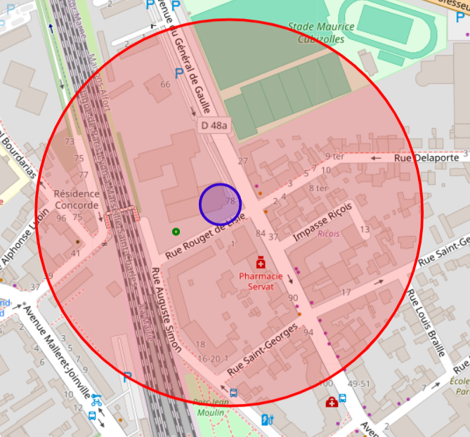
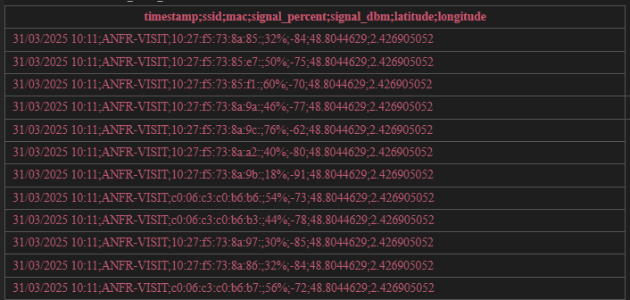
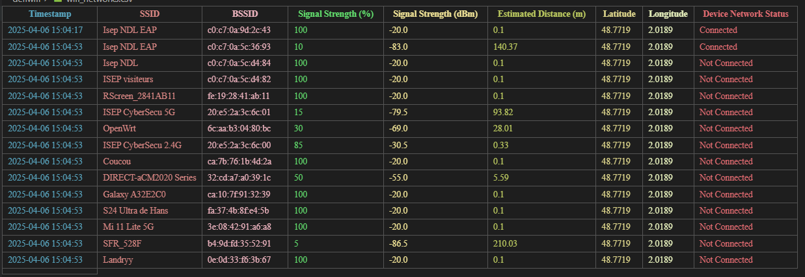

# Défi WiFi Hackathon
In this article I will give a description of the plan behind the 2025 April hackathon with ANFR, and what we learned during the event as well as what I learned after taking a deeper look in how to deal with this project.
The project developed during a hackathon aimed at locating WiFi access points in real time using:
- Network sniffing,
- Distance estimation based on signal strength,
- Map visualization in a Flutter application, and finding the exact points
## 1. Working on the dataset
The original Dataset we were given was of the following format, we used the MAC address as a unique identifier of the network, and the signal strength to determine the distance of the device from the source. Yet, we encountered numerous issues with the dataset.
**Issues:**
- Frequently in the dataset, the same mac address at the same longitude and latitude, emits two signals, with different percentages, resulting in different distances, sometimes resulting in a difference of 10-100m
```json
{
  "SSID": "Freebox-D4E",
  "BSSID": "58:ef:68:cd:d4:ef",
  "signal_dBm": -61,
  "signal_percent": 57,
  "latitude": 48.8566,
  "longitude": 2.3522,
  "timestamp": "2025-04-06T14:34:21"
}
```

Here's, how we looked into retrieving the distance
we used the FSPL (Free Space Path Loss) model :
where :
- 𝑃em ≈ 23dBm
- 𝑃rec : signal mesuré (ex: -65 dBm)
- f=2400 MHz (WiFi 2.4 GHz)
- $d=10^{(Pem − Prec​ + 27.55−20⋅log(10))/20}$

### How this looks in Python
In theory this worked in python,
Initially, we got huge difference in the radius/distance of the device from the hosts, that were really bizarre, resulting in the following:



The hotspot should be located in the intersection of the circles, as given by the distance, we thought about adding a meter margin to account for attenuation, but this was way to much, after tweaking the formula, and renormalizing the signal strength, as we figured the dataset, had issues, we finally ended up with the following:


**Notice**: 
- As discussed, it has to be on the intersection of the circles, but we can at some point remove other circles, and associate it to noise in the dataset.
- As well as removing noise, there isn't a clear intersection, in this case, we give a margin to the circles distance, and find the intersection, as this could be the result of minus obstructions, or loss due to noise as we are converting from percentage to dBm to meters.
## 2. How will we sniff the data on laptops, and androids(IOS not fully compatible)


Here's what we were given for the Hackathon.

And here is the result after sniffing using a python script (you can find the scripts in previous commits if you want)


### Using rust, C and dart:ffi
 **NDK with JNI/FFI**
- Use the `pcap` crate inside a Rust library.
- Build that Rust lib for Android using `cargo-ndk` or manually with `cargo build --target aarch64-linux-android`.
- Expose a simple C-compatible API using `#[no_mangle] extern "C"` to communicate with Android Java/Kotlin or Flutter (via FFI).

with this you can integrate a rust script into your flutter project and get the following result
[screenshot](screen.jpg)

I will use pcap but keep in mind your android must be rooted
Here's an example of pcap in action:
```rust
#[no_mangle]
pub extern "C" fn start_scan() {
    std::thread::spawn(|| {
        let mut cap = pcap::Capture::from_device("wlan0").unwrap().open().unwrap();
        while let Ok(packet) = cap.next() {
            println!("Sniffed {:?}", packet);
        }
    });
}
```
Keep in mind, since we are working on android devices, that you need to pack `libpcap.so` into the android device in order to gain access to pcap.

### eBTF
after some reasearch, eBTF seems relaly adapted to this project. I will use pcap and then try and add an eBTF implementation

# **Installation:**
Install `cargo-ndk` (if not already):
``` bash
cargo install cargo-ndk
```
And clone the repo ;)

Also make sure to install the target 'aarch64-linux-android' with cargo so it runs and make sure to run on android.

Then build for Android targets:
```bash
cargo ndk -t arm64-v8a -o ../android/app/src/main/jniLibs build --release
```

This will place a `.so` file in: `android/app/src/main/jniLibs/arm64-v8a/librust_backend.so`

For testing on PC you need to install the pcap software, and for rust to be able to recognize it download the SDK from [npcap](https://npcap.com/#download])
Extract it into a folder and tell the compiler where to look for it

In the build.rs
```rs
fn main() {
    println!("cargo:rustc-link-search=native=C:\\npcap-sdk\\Lib");
    println!("cargo:rustc-link-lib=wpcap");
    println!("cargo:rustc-link-lib=packet");
    println!("cargo:rustc-link-lib=ws2_32"); // Windows sockets
}
```

5. Trilateration Algorithm Issues
Circle Intersection Problems
Mathematical Challenge: Finding WiFi access point location using multiple distance estimates.
Issues Encountered:

- No Clear Intersection - Circles don't meet at a single point
- Noise in Dataset - Inconsistent measurements create impossible geometries
- Margin Requirements - Need to add significant error margins for any intersection
- Outlier Handling - Some distance estimates are clearly erroneous and need filtering
Current Approach:
- Remove obvious outliers from circle calculations
- Add distance margins to account for measurement errors
- Accept approximate intersections rather than precise points
- Filter noise from dataset before processing

6. User Experience Limitations
- Real-Time Performance Issues
- Network scanning is resource-intensive
- Battery drain on mobile devices
- Processing delays for trilateration calculations
- Map updates may lag behind data collection
- Rooting devices is necessary for this to work
--- Still a work in progress