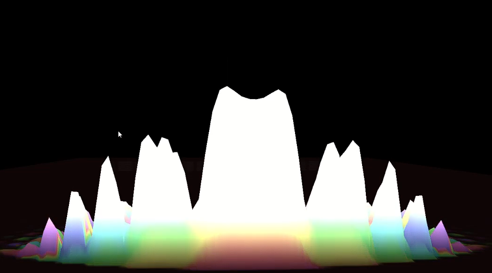
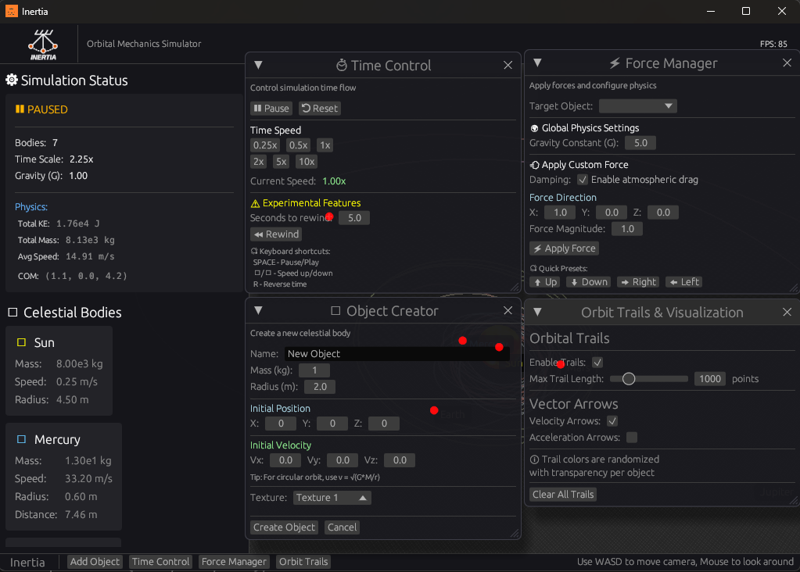

This year in L3 at the university of Paris-Saclay, compared to the previous intensive prep-school rhythm the past two years, has been less stressful. I can now work on my own project and study in-depth things I have a deep interest in.

I will do this devlog a bit differently, I'll start with the main cool feature (which was implemented after the UI/raycasting features had been implemented) quantum mechanics and then show the UI changes and raycastng.

I started this november my quantum mechanics course, which was very intriguing after being subjected to horror stories of how intense the course is, and frankly, it's been pretty exciting and interesting, as it uses pretty robust maths like Fourier transform, algebra, topological math I've become more accustomed to. Anyways enough of the introduction.





# Strife between Quantum and Classical Physics
## Basic Definitions
### I. The Wave Function and Probability

1. Definition of State

The state of a particle of mass $m$ at a time $t$ is fully described by a wave function, denoted as $\psi(\vec{r},t)$

2. Probability Interpretation (Born Rule)

The wave function relates to the probability of finding the particle in a specific region. Specifically, the probability $dP(\vec{r})$ of finding the particle within a volume element $d^3r$ around position $\vec{r}$ is given by the squared modulus of the wave function:

$$d^3P(\vec{r}) = |\psi(\vec{r},t)|^2 d^3r$$

3. Statistical Descriptors

Since the position is probabilistic, we describe the particle's location using statistical means 
Mean Position (Expectation Value): $\langle r \rangle$

4. Variance (Square Deviation):
$$(\Delta r)^2 = \langle r^2 \rangle - \langle r \rangle^2$$

### II. The Schrödinger Equation (Free Particle)

1. De Broglie HypothesisLouis de Broglie (1923) 

proposed that particles with a defined velocity behave like waves. A free particle with definite momentum $\vec{p}$ and energy $E$ 
is described by a monochromatic plane wave:
$$\psi(\vec{r},t) = A e^{i(\vec{k}\cdot\vec{r} - \omega t)}$$
The wave properties are related to particle properties via the fundamental relations 

$\lambda_{dB} = \frac{h}{p}$ implies $k = \frac{p}{\hbar}$ (where $k = \frac{2\pi}{\lambda}$)

Frequency: $E = \hbar\omega$.

2. Linearity and Superposition

Quantum mechanics relies on the Superposition Principle9.If we have a setup like Young's Double Slit experiment, the total wave function at a detector is the sum of the wave functions from each individual slit :
$$\psi_{total} \propto \psi_1 + \psi_2$$

This implies that wave functions form a linear vector space


We can derive the equation of motion for a free particle by combining the plane wave description with the classical energy-momentum relation.1. Energy-Momentum RelationFor a non-relativistic free particle, the total energy is purely kinetic
$$E = \frac{p^2}{2m}$$
2. Operator Correspondence

By differentiating the plane wave 
$\psi = e^{i(pr - Et)/\hbar}$, we identify the quantum operators

Time evolution: 
$i\hbar \frac{\partial}{\partial t} \rightarrow E$ 

Spatial curvature (Laplacian): $-\hbar^2 \Delta \rightarrow p^2$ (since $\hat{p} = -i\hbar\nabla$)

3. The Wave Equation

$$i\hbar \frac{\partial}{\partial t}\psi(\vec{r},t) = -\frac{\hbar^2}{2m} \Delta \psi(\vec{r},t)$$
## III. Wave Packets & Fourier Analysis
1. The Problem with Plane Waves

A single monochromatic plane wave (representing a particle with exact momentum $p$) extends infinitely in space. It cannot represent a localized physical particle because it is not square-integrable (it cannot be normalized to 1)

2. Constructing a Wave Packet

To describe a localized particle, we use the superposition principle to sum up (integrate) many plane waves with different momenta. This forms a Wave Packet.The mathematical tool for this is the Fourier Transform. We define the wave packet $\psi(\vec{r},t)$ as an integral over momentum space, weighted by a function $g(k)$ or $\phi(p)$, such that :

$$\psi(\vec{r},t) = \frac{1}{(2\pi\hbar)^{3/2}} \int \phi(\vec{p}) e^{\frac{i}{\hbar}(\vec{p}\cdot\vec{r} - E(p)t)} d^3p$$

$\phi(\vec{p})$ acts as the "weighting factor" or spectral function. By the Parseval-Plancherel theorem, if $\phi(\vec{p})$ is normalized, then the resulting spatial wave function $\psi(\vec{r},t)$ is also normalized.

In quantum mechanics, there is a specific "standard" convention chosen to make the physics.
- **The Standard QM Definition** Using Unitary Fourier Transform. This splits the messy $2\pi\hbar$ factor evenly between the forward and backward transforms.Forward (Position $\to$ Momentum):$$\phi(p) = \frac{1}{\sqrt{2\pi\hbar}} \int_{-\infty}^{\infty} \psi(x) e^{-\frac{i}{\hbar}px} dx$$Inverse (Momentum $\to$ Position):$$\psi(x) = \frac{1}{\sqrt{2\pi\hbar}} \int_{-\infty}^{\infty} \phi(p) e^{+\frac{i}{\hbar}px} dp$$

## Simulation implementation
In order to simulate how this works, a simulation of the Schrödinger equation must be done, which would take alot of computation power especially on the CPU, thankfully Inertia uses OpenGL.

A shader in OpenGL is a program that runs _simultaneously_ for every single pixel (or grid point). This is an almost perfect hardware match for the problem.

If we were to map out all the relevant data of a particles wave function (which holds all the information about the state of the particle, onto some plane, and use the GPU to run calculations in OpenGL), we would be able to run numerous operations at a low cost.

The infamous equation :
$$i\hbar \frac{\partial}{\partial t}\psi(x, t) = \hat{H}\psi(x, t)$$

- **The Grid:** describe the 2D simulation as a texture. A 256*256 texture, representing a 256\*256 grid of points in space.
    
- **The Potential ($V(x, y)$):** This is your "level." It's _another_ texture that defines where the "walls," "slits" (like in the double-slit experiment), or "quantum wells" are. A high value in this texture means high potential energy, which will "push" the wavefunction away. A low value is a place the particle "likes" to be.

- OpenGL can't read from and write to the same texture at the same time. So, how to update the state? using _two_ copies of your wavefunction texture and "ping-pong" between them.

## Estimation of the Schrödinger equation

### Discretization
First the we must go through a phase of discretization. The computer cannot store an infinite continuous wave. 
We define our grid points as 
$(i, j)\in [[1;256]]$ and time steps as $n\in\mathbb{N}$.
- $x \to i \cdot \Delta x$ (where $i$ is the pixel column)
- $y \to j \cdot \Delta x$ (where $j$ is the pixel row)
- $t \to n \cdot \Delta t$ (where $n$ is the frame number)

So, $\psi(x, y, t)$ becomes the discrete value $\psi_{i,j}^{n}$.

### The Laplacian ($\nabla^2$) and Finite Difference
This is the most complex part of the shader code. 
The Laplacian operator measures how much a function "curves" or diverges from the average of its neighbors. 
$$\Delta \psi = \frac{\partial^2 \psi}{\partial x^2} + \frac{\partial^2 \psi}{\partial y^2}$$

To calculate this on a pixel grid, we use the Taylor formula for functions of different variables. If we look at a pixel $\psi_i$ and its right neighbor $\psi_{i+1}$,

$$ \psi_{i+1} \approx \psi_i + (\Delta x) \psi'_i + \frac{1}{2}(\Delta x)^2 \psi''_i $$

Which gives,

$$ \psi_{i-1} \approx \psi_i - (\Delta x) \psi'_i + \frac{1}{2}(\Delta x)^2 \psi''_i $$

If we add these two equations together, the first derivatives ($\psi'$) cancel out, allowing us to solve for the second derivative ($\psi''$):
$$\frac{\partial^2 \psi}{\partial x^2} \approx \frac{\psi_{i+1} - 2\psi_i + \psi_{i-1}}{(\Delta x)^2}$$

When we apply this to both the $x$ and $y$ axes on a 2D grid, we get the 5-Point Stencil formula:
$$\nabla^2 \psi_{i,j} \approx \frac{\psi_{i+1, j} + \psi_{i-1, j} + \psi_{i, j+1} + \psi_{i, j-1} - 4\psi_{i,j}}{(\Delta x)^2}$$

This maps directly to:
$$ \text{Laplacian} = (\text{Right} + \text{Left} + \text{Up} + \text{Down} - 4 \cdot \text{Center}) / (\text{dx} \cdot \text{dx}) $$
### The Hamiltonian

Representing the total energy, it combines the Laplacian (Kinetic Energy) we just calculated with the Potential.
$$\hat{H}\psi = -\frac{1}{2}\nabla^2\psi + V\psi$$

In discrete terms at pixel $(i,j)$:

$$
\hat{H}\psi_{i,j} = -\frac{1}{2} \left[ \frac{ \psi_{i+1,j} + \psi_{i-1,j} + \psi_{i,j+1} + \psi_{i,j-1} - 4\psi_{i,j} }{(\Delta x)^2} \right] + V_{i,j}\,\psi_{i,j}
$$

### Coupled ODEs
Because $\psi$ is a complex number ($R + iI$), let us start with :
$$ i \frac{\partial \psi}{\partial t} = \hat{H}\psi $$
and substitute $\psi = R + iI$ : 

$$ i \left( \frac{\partial R} {\partial t} + i \frac{\partial I}{\partial t} \right) = \hat{H} (R + iI)$$

$$ i \frac{\partial R}{\partial t} - \frac{\partial I}{\partial t} = \hat{H}R + i\hat{H} I $$

By the unicity of the complex cartesian form :
$$ -\frac{\partial I}{\partial t} = \hat{H}R \implies \frac{\partial I}{\partial t} = -\hat{H}R$$
$$\frac{\partial R}{\partial t} = \hat{H}I$$
The change in the Real part is driven by the Hamiltonian of the Imaginary part, and vice versa. This "rotation" in the complex plane is what causes the wave to oscillate.

### Time Integration
Finally, to find the wavefunction at the next frame ($n+1$), we can use Euler's method and linear extrapolation based on the time step $\Delta t$ this may not be completely accurate but it's a close enough approximation to simplify our calculations and will be more accurate given how small $\Delta t$. Linear extrapolation will only provide good results when used to extend the graph of an approximately linear function or not too far beyond the known data, here it's a lc
$$\psi^{n+1} = \psi^n + \frac{\partial \psi}{\partial t} \cdot \Delta t$$

Using our split equations the equations become the following once again by the unicity of the complex cartesian form :

$$R_{i,j}^{n+1} = R_{i,j}^n + (\hat{H} I_{i,j}^n) \cdot \Delta t$$ $$I_{i,j}^{n+1} = I_{i,j}^n + (-\hat{H} R_{i,j}^n) \cdot \Delta t$$

#### *NOTE* :

Because we use linear extrapolation, the magnitude of the wave function $|\psi|^2$ will grow over time (the wave will gain energy from nowhere and explode).
and so in earlier tests this would cause big issues, I had to dampen the energy based on the distance from center of the wave, and smooth the wavefunction texture, which meant that now the wavefunction was loosing energy, and so the values used for the Gaussian wave packet had to be well chosen in such a way that it doesn't cause energy to deplete quickly, and to not explode
Normalization: The probability will eventually exceed 1.0.

## Compute Shader

Compute shaders are GPU programs that perform **general-purpose computation** (not just rendering). Unlike vertex/fragment shaders (which draw triangles), compute shaders process arbitrary data in parallel.

Solving the Schrödinger equation. Each pixel of the 256×256 wavefunction texture is updated in parallel by a compute shader, making it ~65,000× faster than doing it on the CPU sequentially.

```rust
pub struct ComputeShader {
    program_id: gl::types::GLuint,  
    // OpenGL handle to the compiled shader program
    
    work_group_size: (u32, u32, u32), 
    // Thread block dimensions (e.g., 16×16×1)
}
```
1. **`program_id`**: The OpenGL ID of the compiled compute shader.
2. **`work_group_size`**: How many threads run together in a group. Parsed from the shader code:
   ```glsl
   layout(local_size_x = 16, local_size_y = 16) in;
   ```
   This means threads are organized into 16×16 blocks (256 threads per block).
### **`bind()` / `unbind()`** Compute shaders
- `bind()` calls `gl::UseProgram(program_id)`
- `unbind()` calls `gl::UseProgram(0)`

### **`set_uniform_float(name, value)` / `set_uniform_int(name, value)`**
1. Finds the uniform variable's location in the shader:
   ```rust
   let location = gl::GetUniformLocation(program_id, "u_dt");
   ```
2. Sets its value:
   ```rust
   gl::Uniform1f(location, 0.001); // Sets u_dt = 0.001
   ```

### `bind_texture(binding, texture, access)`**
Useful as said earlier we are using textures to represent the wavefunction, and so we need to give a reference to the texture in memory to OpenGL as well as the kind of access OpenGL has over it.
```rust
shader.bind_texture(0, &output_texture, TextureAccess::WriteOnly);
```
**In GLSL:**
```glsl
layout(binding = 0, rg32f) uniform image2D u_next_psi; // Writable
```

### **`bind_sampler(unit, texture)`**
- Activates a texture unit (`gl::ActiveTexture(gl::TEXTURE0 + unit)`).
- Binds the texture to that unit (`gl::BindTexture(gl::TEXTURE_2D, id)`).
```rust
shader.bind_sampler(4, &input_texture);
shader.set_uniform_int("u_current_psi", 4); // Tell shader to use unit 4
```
**Shader Side:**
```glsl
uniform sampler2D u_current_psi; // Read-only
```

### **`dispatch(num_groups)` / `dispatch_auto(grid_size)`**
tells the GPU to run the shader in a 3D grid of work groups.
```rust
shader.dispatch_auto((256, 256, 1)); 
```
- Here a texture is a grid of size 256×256 pixels
- We said that size of a work group is (16, 16, 1)
- And 16 x 16 work groups.
- Total threads: 16x16 x 16x16 = 65,536 
- Which is one per pixel

### **`barrier(barrier_type)`**
Ensure compute writes are visible to subsequent operations.
`gl::MemoryBarrier(bits)` forces the GPU to finish all pending writes before continuing.

Without a barrier, you might try to **read** the texture before the compute shader has **finished writing** to it, causing visual glitches (reading old/corrupted data).

## Conclusion
Learning about how quantum mechanics, has been really interesting although I can barely say I know quantum mechanics, as this is only the introduction, I will continue to study and read about it and look into how to integrate more complex features into Inertia. I also got to look into for once compute shaders and how they can be used. As well as integrating them within the glium/egui workspace as they're not natively integrated.

If you want to watch a video of all the simulations, you can click on the video below.



# Touching the Stars: Implementing Ray Casting in Inertia


In the latest update to **Inertia**, A whole restructuring of the innerworkings of Inertia, there are more updates in a version I call (Hamiltonian) version of inertia to look out for as well. 

The goal was to bridge the gap between the user’s screen and the simulated cosmos. How so you may be asking.

A ray casting system that allows for precise object intersection and selection in 3D space.
## Ray Casting

At its core, "selecting" an object in a 3D engine involves shooting an invisible line (a ray) from the camera’s position through the specific pixel on the screen where the mouse is hovering. If that line hits a celestial body, we register a selection.

### 1. Defining the Ray

A ray in 3D space is defined parametrically by an origin point $\mathbf{O}$ (the camera's position) and a normalized direction vector $\vec{D}$.

Where $(\mathbf{O},\vec{D}) \in \mathbb{R}^3$
$$\forall t \in \mathbb{R}^+, \mathbf{P}(t) = \mathbf{O} + t\vec{D}$$
To get $\vec{D}$ from the mouse coordinates, we take the 2D screen position $(x, y)$ and transform it into World Space. This involves reversing the rendering pipeline: applying the inverse of the projection matrix and the view matrix.

### 2. The Sphere-Ray Intersection
Since our astral bodies are modeled as spheres, we can use a computationally efficient algebraic solution to check for intersections. A sphere is defined by all points $\mathbf{P}$ that are a distance $r$ (radius) from a center $\mathbf{C}$.

$$||\mathbf{P} - \mathbf{C}||^2 = r^2$$

To find where the ray hits the sphere, we substitute the ray equation into the sphere equation:

$$||(\mathbf{O} + t\vec{D}) - \mathbf{C}||^2 = r^2$$

This expands into a classic quadratic equation in the form $at^2 + bt + c = 0$:

1. **$a = \vec{D} \cdot \vec{D}$** (Since $\vec{D}$ is normalized, $a=1$)
    
2. **$b = 2(\mathbf{O} - \mathbf{C}) \cdot \vec{D}$**
    
3. **$c = (\mathbf{O} - \mathbf{C}) \cdot (\mathbf{O} - \mathbf{C}) - r^2$**
    

### 3. Solving for Interaction

We solve for $t$ using the quadratic formula. The key is the **discriminant** ($\Delta = b^2 - 4ac$):

- If $\Delta < 0$: The ray misses the sphere entirely (no interaction).
    
- If $\Delta \ge 0$: The ray intersects the sphere. We take the smallest positive $t$ to find the nearest intersection point—this is the object the user clicked on.

### 4. UI additions

I've just pushed a significant update to the orbital simulator part of Inertia, focusing on bridging the gap between the physics engine and the user interface by redoing some of the redundant ui aspects, that makes it more appealing, but also integrating the Ray Casting features, a fundamental feature that paves the way for direct 3D interactions within the simulation, as well as adding more interesting in-scene ui features.

For instance the engine detects which celestial body is under your mouse cursor in the 3D viewport, some issues do arise, but nameplates and orbital trails are fundemental features that helps users and is a good start to making Inertia robust and move towards a fully interactive sandbox where you can click to select planets, view their specific orbital data, or drag to manipulate them in real-time.

Modular UI Architecture: I’ve completely refactored the UI modules to be more modular and extensible. By separating the control widgets from the core system, the interface is now cleaner and easier to expand. This backend improvement ensures that adding new tools—like the recently added debugging widgets—is smoother and doesn't clutter the rendering pipeline.

New Debugging Widgets: Building on the new system, I’ve added new widgets that provide better insight into the simulation's state. These additions function alongside the live physics display, giving you more granular control and visibility over the orbital mechanics as they unfold.



Anyways, if you read all the way through thanks and share, I'll keep working on this, and would appreciate anyone reading or commentary on my work.