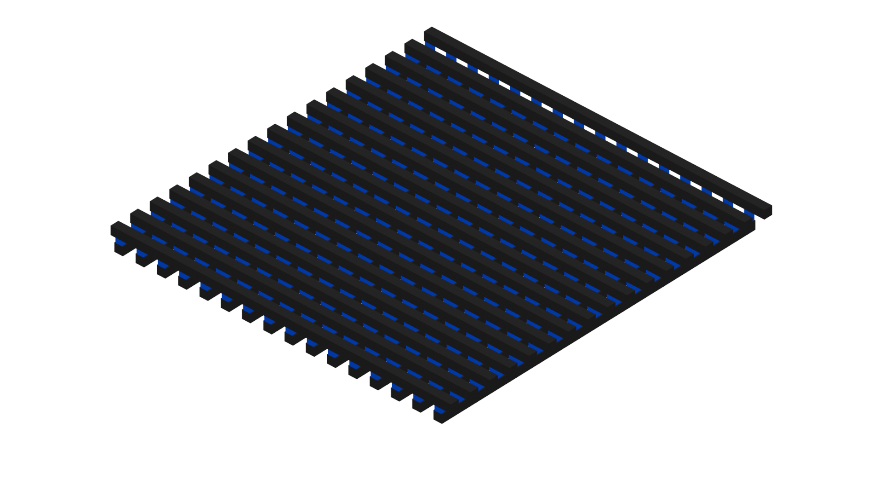
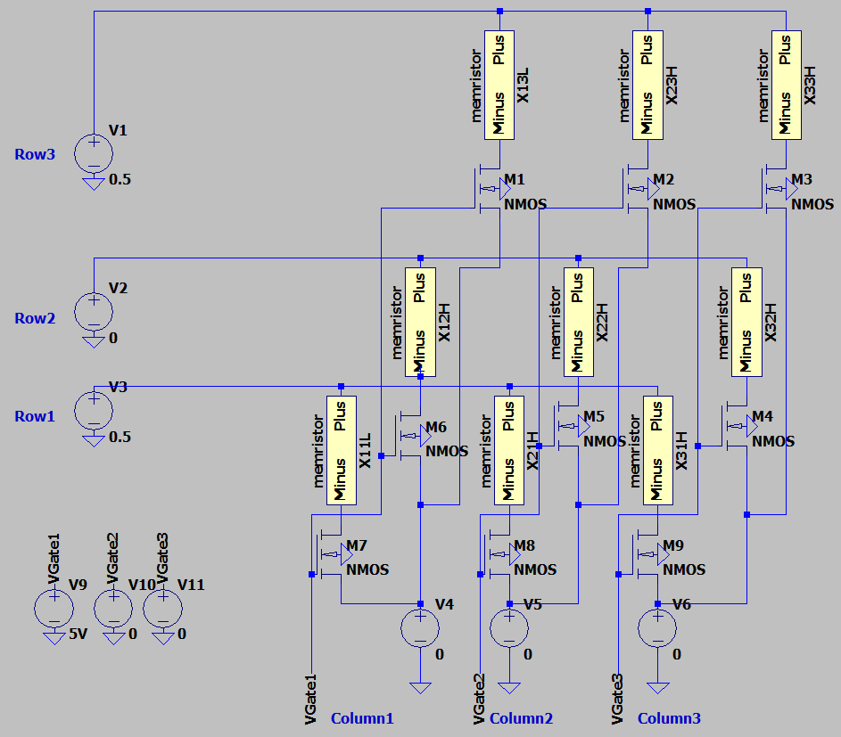
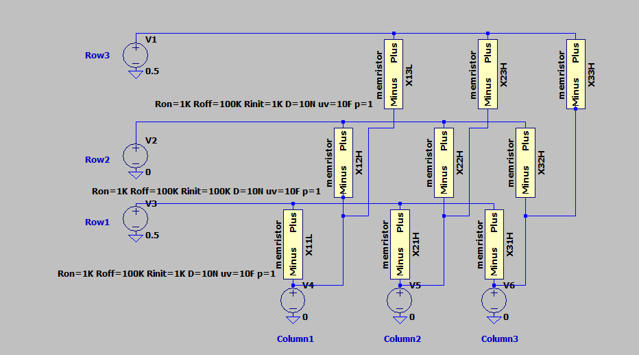
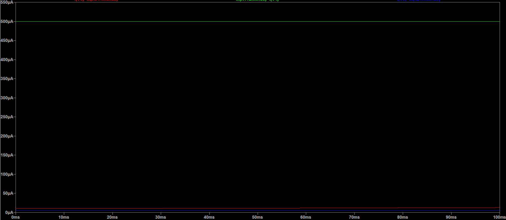

# The Missing Circuit Element

If you’ve been following the latest trends in hardware for AI and neuromorphic computing, you’ve likely heard about memristors, if not, this is your chance to get a deeper look at something really unique. Often touted as the "missing circuit element," memristors hold the key to efficient in-memory computation—a holy grail for next-gen computing architectures.

Today, I want to highlight my open-source project that dives deep into this technology.

Whether you are a student, a researcher, or just an electronics enthusiast, this repository offers a comprehensive starting point for understanding the state-of-the-art in resistive switching technology. After looking into different papers on first how this non-linear component was discovered and the physics behind it, I look into how it can be used in neuromorphics.

# What is the Project?

At its core, *memris-research* is a research repository that combines the theoretical analysis with practical simulation. Focuses on the application of memristors in neuromorphic computing and Matrix-Vector Multiplication (MVM) the mathematical backbone of neural networks. As well as the paper with all the relevant analysis of a simple 3x3 structure it also provides a study done in julia.

# What’s Inside?
The repository is structured to guide you through both the "why" and the "how" of memristor technology.

## State-of-the-Art Analysis
The centerpiece of the repo is the full research paper (memris-research.pdf). It walks you through:

History: From Leon Chua’s 1971 theory to the HP Labs discovery in 2008.

Mechanisms: How resistive switching (SET/RESET) actually works.

Architectures: A comparison between Passive (0T1R) and Active (1T1R) crossbar arrays.

## Hands-on SPICE Simulations
Theory is great, but seeing the circuits in action is better. The project provides ready-to-use LTspice simulation files

*Schematic of a passive crossbar array (0T1R) showing direct connections between word and bit lines.*

*Active crossbar array with transistor selectors (1T1R) for improved selectivity and reduced sneak paths.*

*LTspice simulation results for passive crossbar array showing voltage and current characteristics.*

*Transient analysis of passive crossbar array demonstrating dynamic behavior during read/write operations.*

## Critical Performance Analysis
It includes detailed analysis on IR Drop (voltage loss in wires), which is a major challenge in scaling up crossbar arrays. You'll find generated plots and data regarding wire resistance and its impact on calculation errors.

## What’s Next: The Julia Framework
Developing a simulation framework using Julia. Aimed to include robust tools for device parameter structures and sparse solvers for analyzing larger arrays efficiently.

## Why You Should Check It Out
If you are looking to understand how hardware can mimic the brain's synapses.

[View the Repository on GitHub](https://github.com/MadebyDaris/memris-research)